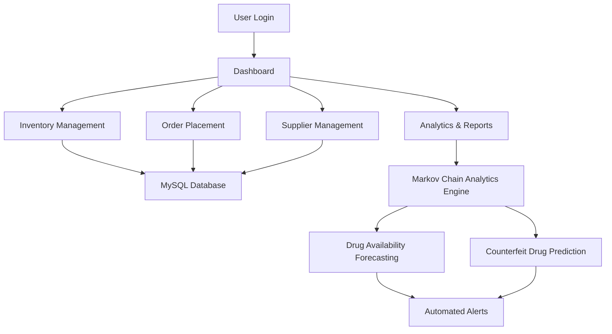

# Medical Supply Management & Counterfeit Drug Analysis System

An AI-powered healthcare supply chain and counterfeit drug analysis platform designed to address medicine shortages, inventory inefficiencies, and counterfeit drug circulation in India during large-scale public health crises such as COVID-19.

The system combines a web-based inventory management platform with predictive analytics using Markov Chain simulations to forecast drug availability, identify supply chain vulnerabilities, and support data-driven healthcare decision-making.

---

# Features

- Real-time medical inventory management
- Supplier and order tracking dashboard
- Drug batch and expiry monitoring
- Counterfeit drug risk analysis
- Predictive analytics using Markov Chain simulation
- Automated low-stock and risk alerts
- Real-time healthcare data visualization
- Role-based authentication system
- Scalable healthcare supply chain workflows

---

# Problem Statement

Healthcare supply chains often face:
- medicine shortages during emergencies
- counterfeit drug circulation
- delayed inventory visibility
- inefficient supplier coordination
- lack of predictive healthcare analytics

This project aims to solve these issues by integrating:
- inventory management
- predictive analytics
- counterfeit drug detection
- supply chain intelligence
- real-time visualization systems

---

# Tech Stack

## Frontend
- HTML
- CSS
- JavaScript

## Backend
- Flask (Python)
- PHP

## Database
- MySQL

## Data Analytics & Simulation
- NumPy
- Pandas
- Matplotlib
- Markov Chain Simulation

## Visualization
- Chart.js

## Server Environment
- XAMPP

---

# Key Functionalities

## Inventory Management
- Add/update medical stock
- Batch tracking
- Expiry monitoring
- Inventory visibility

## Supplier Management
- Supplier logs
- Order tracking
- Procurement workflows

## Predictive Analytics
- Drug availability forecasting
- Counterfeit drug probability analysis
- Supply chain vulnerability prediction

## Dashboard & Reporting
- Interactive charts
- Real-time analytics
- Automated alert system

---

# System Architecture



---

# Dashboard Capabilities

- Drug stock monitoring
- Supplier activity tracking
- Order management
- Risk analytics
- Demand forecasting
- Low-stock alerts
- Counterfeit probability insights

---

# Predictive Analytics Workflow

```text
Historical Drug Data
        ↓
Data Processing
        ↓
Markov Chain Simulation
        ↓
Supply Forecasting
        ↓
Counterfeit Risk Detection
        ↓
Alert Generation
        ↓
Healthcare Decision Support
```

---

# Future Improvements

- Cloud deployment
- Deep learning-based forecasting
- Blockchain-enabled drug verification
- API integration with pharmacies and hospitals
- Real-time IoT inventory monitoring
- Advanced AI-based counterfeit classification
- Multi-region healthcare analytics

---

# Installation

Clone the repository:

```bash
git clone https://github.com/ashwanirawat113/Understanding_Medical_Supply_Chain.git
```

Move into the project directory:

```bash
cd Understanding_Medical_Supply_Chain
```

Install required dependencies:

```bash
pip install -r requirements.txt
```

---

# Running the Project

Start the Flask application:

```bash
python app.py
```

Run XAMPP services:
- Apache
- MySQL

Open browser:

```text
http://localhost/
```

---

# Repository Structure

```text
├── static/
├── templates/
├── database/
├── analytics/
├── charts/
├── app.py
├── requirements.txt
└── README.md
```

---

# Author

## Ashwani Rawat

- LinkedIn: https://linkedin.com/in/ashwani-rawat25
- GitHub: https://github.com/ashwanirawat113

---

# License

This project is developed for educational, research, and innovation purposes.
